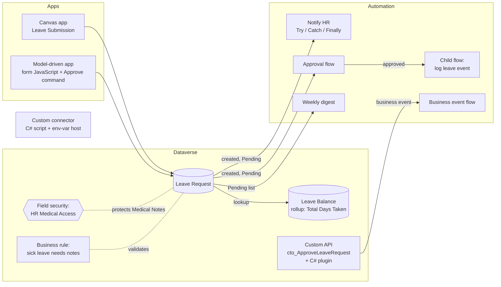

# Leave Management on Microsoft Power Platform

A leave request and approval solution built on **Dataverse**, with model-driven and canvas apps, form JavaScript, a Custom API with a business event, a custom connector with C# script code, and Power Automate approvals.

> **Personal project.** I built it in my own developer environment to practise Power Platform developer (PL-400) skills hands-on. It uses sample data only and has no link to any employer or client.

---

## Architecture



## What it demonstrates

| Area | Implementation |
|---|---|
| Data model | Two custom tables, lookups, a global choice (Leave Types), a rollup column for days taken, and table-level auditing |
| Security | A field security profile so only HR can read **Medical Notes** |
| Form JavaScript | One namespaced library: OnLoad, OnSave (cancels invalid saves), OnChange, `addPreSearch` lookup filtering, and a live balance check with `Xrm.WebApi` |
| Business rule | Server-side check that sick leave includes medical notes |
| Custom API + plugin | `cto_ApproveLeaveRequest`, bound to Leave Request, exposed as a **business event** in a catalog |
| Custom connector | OpenAPI definition, C# script code that builds a mock `GetLeaveTypes` response, and a dynamic host policy driven by an environment variable |
| Power Automate | Approvals, trigger conditions, a Try / Catch / Finally error pattern, a child flow, a scheduled digest, and a business event trigger |
| Canvas app | A reusable component with input and output properties, `Patch`, `IfError` and `Trace` diagnostics |
| Commanding | A modern command (Power Fx) **Approve** button in the model-driven app |
| ALM | One solution, a publisher prefix (`cto`), environment variables and connection references; no hard-coded emails |

## Components

| Type | Name |
|---|---|
| Tables | `cto_leaverequest`, `cto_leavebalance` |
| Apps | Leave Request (model-driven), Leave Submission (canvas) |
| Web resource | `cto_LeaveRequestForm` (the only form script) |
| Cloud flows | Notify HR of New Leave Request, Leave Request Approval, Child – Log Leave Event, Scheduled Weekly Digest, Get Leave Summary, Business Event – Leave Approved |
| Custom API | `cto_ApproveLeaveRequest` (input: `Comments`; outputs: `Success`, `ResultMessage`) |
| Connector | Leave API (custom connector; host `leaveapi.example.com` is a placeholder) |
| Environment variables | `cto_HRNotificationEmail`, `cto_LeaveAPIHost` |
| Connection references | Dataverse, Approvals, Office 365 Outlook |

## How to install

1. **Create a developer environment.** A free [Power Apps Developer Plan](https://learn.microsoft.com/power-platform/developer/plan) environment works.
2. **Import** `releases/LeaveManagement_1_0_0_5.zip` (Solutions → Import).
3. **During import**, create or select connections for Dataverse, Approvals and Office 365 Outlook, and enter a value for **HR Notification Email**.
4. **Turn on** the cloud flows, then assign yourself the **HR Medical Access** field security profile to see Medical Notes.
5. **Connect the plugin.** Build `src/plugins`, register the assembly with the Plugin Registration Tool, then set **Plugin Type** on the `cto_ApproveLeaveRequest` Custom API. Until then, the Custom API and its business event work, but approval logic doesn't run.

## Repository layout

```
releases/            Importable solution zip (unmanaged)
src/solution/        Same solution, extracted, so changes show up in diffs
src/canvas-app/      Canvas app source in readable YAML (review only)
src/plugins/         C# plugin behind the Custom API
```

## Changes in v1.0.0.5

- Unlinked the plugin from the Custom API so the solution imports into a clean environment. The plugin was registered outside the solution, and a clean-environment import test caught it. Lesson: test every release by importing into an empty environment.

## Changes in v1.0.0.4

- Removed hard-coded email addresses; flows read **HR Notification Email** from an environment variable.
- The approval flow now triggers on **create only**. Before, any edit to a pending request started a second approval. It also stamps the approval date.
- Merged five overlapping form scripts into one library. This fixed a sick-leave check that compared against the wrong choice value (2 instead of 4002), and removed a duplicate End Date handler.
- Turned on table-level auditing (column auditing was already set, but it has no effect while the table setting is off).
- Added the missing Office 365 connection reference, removed an unused Excel one, and switched the child flow to an embedded connection.
- The "weekly" digest now actually runs weekly.
- Removed three data-seeding flows that relied on record IDs from one environment.
- Renamed display names from the "Contoso" lab naming to **Leave Management**. Internal schema names (the `cto_` prefix, app and catalog unique names) stay as first created, because Dataverse doesn't allow renaming them.

## Known gaps and roadmap

I keep this list on purpose: it's where the next version goes.

- [ ] **Canvas app:** restore the commented-out validation and calculate Total Days with `DateDiff(...) + 1` instead of a fixed `1`.
- [ ] **Single source of truth for Total Days:** move the calculation to the server (formula column or plugin), so the form, canvas app, flows and API all agree. Today only the model-driven form calculates it.
- [ ] **Working days:** exclude weekends and public holidays.
- [ ] **Employee lookup:** points to Contact. For internal staff, a lookup to User (`systemuser`) would fit better.
- [ ] **Primary column:** the schema name is `cto_newcolumn` (display name "Request Number"). Schema names can't be renamed, so the fix is a new column plus a data move.
- [ ] **Security roles:** add Employee, Manager and HR roles to the solution.
- [ ] **Package the plugin** inside the solution (Add existing → Plug-in assembly), so a single import includes the approval logic.
- [ ] **Copilot Studio agent:** answer "How many leave days do I have left?" by calling the Custom API.
- [ ] **PCF control:** a leave-balance progress bar.
- [ ] **CI/CD:** GitHub Actions with Power Platform Build Tools (export, unpack, Solution Checker, import).

## Author

**Vinay Matsa** – Power Platform Developer, Hyderabad
Microsoft Certified: PL-400, PL-200, PL-100, PL-900
[LinkedIn](https://linkedin.com/in/vinay-matsa-6b579716b)
